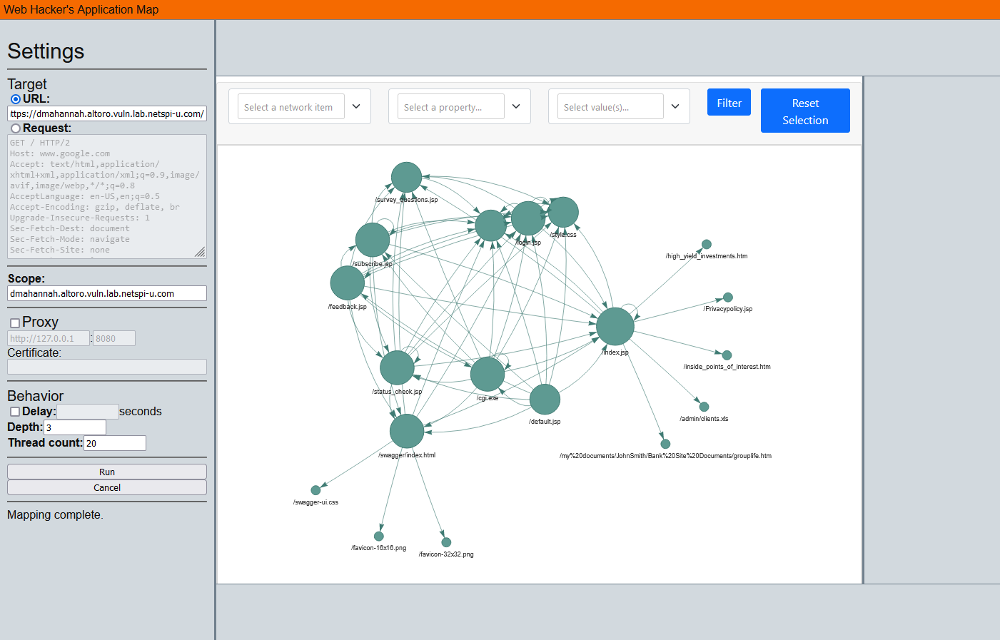

# WHAM
## Web Hacker's Application Map

### Description

A web application visualizer built using Flask, PyVis and urllib3.

### Setup
Install the required python libraries
```
pip install -r requirements.txt
```
Run the application
```
python WHAM.py
```
then navigate to 127.0.0.1:5000 in your browser



### Contributions
